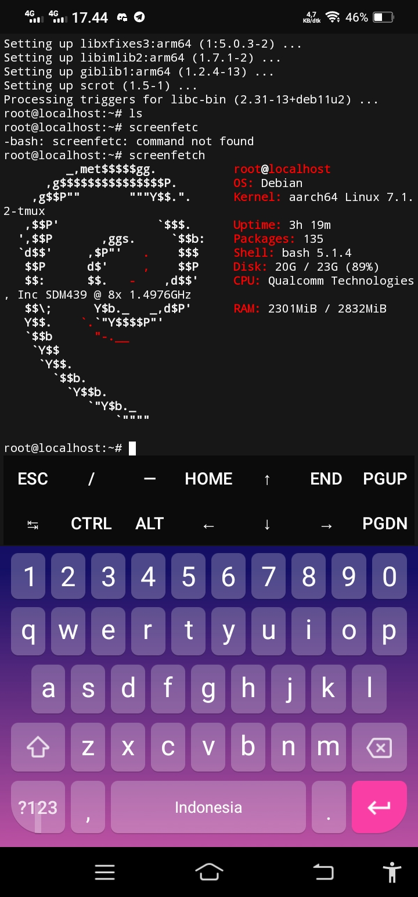

# debian-stable
This Script Will Install Debian In You Termux! 



## Package Must Installed 🚀
```terminal
curl 
wget 
proot 
tar
```

# important
> this Script only work in termux
> architecture required : aarch64 only

# Task
- [x] Release
- [ ] Fix Bugs


## Feature ⭐
* Lightweight Rootfs
* Terminal Only
* Open Source
* You Can Get Rootfs From [Here](https://github.com/debuerreotype/docker-debian-artifacts/tree/master).


## Usage
```bash
apt install git -y
git clone https://github.com/itzYoungHazn/debian-stable.git
cd debian-stable
bash bash
```

